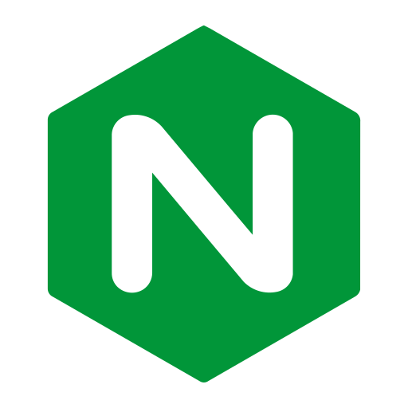

| Image                                                              | Service                                                                           | Description                                                                                                                                                                                                                                                                           |
| ------------------------------------------------------------------ | --------------------------------------------------------------------------------- | ------------------------------------------------------------------------------------------------------------------------------------------------------------------------------------------------------------------------------------------------------------------------------------- |
|       | [AdGuard Home](https://adguard.com/en/adguard-home/overview.html)                 | Network-wide ad blocker and privacy protection solution.                                                                                                                                                                                                                              |
|    | [AdGuard Home Sync](https://docs.linuxserver.io/images/docker-adguardhome-sync/)  | Syncs configurations and data across multiple AdGuard Home instances.                                                                                                                                                                                                                 |
|           | [Airsonic Advanced](https://docs.linuxserver.io/images/docker-airsonic-advanced/) | Advanced media streaming server with support for multiple formats and streaming protocols.                                                                                                                                                                                            |
|           | [Authelia](https://github.com/authelia/authelia)                                  | Authelia is an open-source authentication and authorization server providing two-factor authentication and single sign-on (SSO) for your applications via a web portal.                                                                                                               |
|             | [AutoIndex](https://github.com/dceoy/docker-nginx-autoindex)                      | Automatically generates directory indexes for web servers with customizable themes.                                                                                                                                                                                                   |
|             | [Bazarr](https://docs.linuxserver.io/images/docker-bazarr/)                       | Bazarr is a companion application to Sonarr and Radarr. It can manage and download subtitles based on your requirements. You define your preferences by TV show or movie and Bazarr takes care of everything for you.                                                                 |
|             | [CertDumper](https://github.com/kereis/traefik-certs-dumper)                      | Dumps Let's Encrypt certificates of a specified domain which Traefik stores in acme.json.                                                                                                                                                                                             |
|  | [Cloudflare Bouncer](https://github.com/crowdsecurity/cs-cloudflare-bouncer)      | Service to manage and rotate Cloudflare API tokens for increased security.                                                                                                                                                                                                            |
|           | [Crowdsec](https://github.com/crowdsecurity/crowdsec)                             | Security automation tool to protect your server from malicious actors.                                                                                                                                                                                                                |
|       | [DDNS Updater](https://github.com/qdm12/ddns-updater?tab=readme-ov-file)          | Service for keeping your dynamic DNS records updated automatically.                                                                                                                                                                                                                   |
|             | [Deunhealth](https://github.com/qdm12/deunhealth)                                 | Restart your unhealthy containers safely.                                                                                                                                                                                                                                             |
|          | [Docker-GC](https://github.com/clockworksoul/docker-gc-cron)                      | Automatically cleans up unused Docker images and containers.                                                                                                                                                                                                                          |
|             | [Dockge](https://github.com/louislam/dockge)                                      | A fancy, easy-to-use and reactive self-hosted docker compose.yaml stack-oriented manager.                                                                                                                                                                                             |
|             | [Dozzle](https://github.com/amir20/dozzle)                                        | Dozzle is a small lightweight application with a web based interface to monitor Docker logs. It doesn’t store any log files. It is for live monitoring of your container logs only.                                                                                                   |
|            | [Firefly III](https://github.com/firefly-iii/firefly-iii)                         | Personal finance manager for tracking and managing your expenses and income.                                                                                                                                                                                                          |
|            | [Firefox](https://github.com/jlesage/docker-firefox)                              | Open-source web browser known for its privacy and customization options.                                                                                                                                                                                                              |
|            | [Glances](https://github.com/nicolargo/glances)                                   | Cross-platform system monitoring tool providing a comprehensive view of system performance.                                                                                                                                                                                           |
|            | [Gluetun](https://github.com/qdm12/gluetun)                                       | Lightweight swiss-knife-like VPN client to multiple VPN service providers.                                                                                                                                                                                                            |
|            | [Grafana](https://github.com/grafana/grafana)                                     | Open-source platform for monitoring and observability with customizable dashboards.                                                                                                                                                                                                   |
|          | [Guacamole](https://github.com/apache/guacamole-server)                           | Clientless remote desktop gateway for accessing remote desktops through a web browser.                                                                                                                                                                                                |
|           | [Homepage](https://github.com/gethomepage/homepage)                               | Personal homepage and dashboard application for organizing links and widgets.                                                                                                                                                                                                         |
|           | [InfluxDB](https://github.com/influxdata/influxdb)                                | Open-source time series database designed for high-performance data collection and querying.                                                                                                                                                                                          |
|     | [IT Tools](https://github.com/CorentinTh/it-tools)                                | Collection of utilities for IT professionals, including network tools and system monitors.                                                                                                                                                                                            |
|        | [JDownloader](https://github.com/jlesage/docker-jdownloader-2)                    | Open-source download manager with support for many file hosting services.                                                                                                                                                                                                             |
|           | [Jellyfin](https://github.com/jellyfin/jellyfin)                                  | Open-source media server that allows you to manage and stream your media collection.                                                                                                                                                                                                  |
|            | [Kaizoku](https://github.com/oae/kaizoku)                                         | Manga and comic book reader and manager with extensive metadata support.                                                                                                                                                                                                              |
|               | [Kasm](https://docs.linuxserver.io/images/docker-kasm/)                           | Web-based virtual desktop and application platform.                                                                                                                                                                                                                                   |
|             | [Kavita](https://github.com/Kareadita/Kavita)                                     | Self-hosted media server for managing and streaming your digital library.                                                                                                                                                                                                             |
|              | [Komga](https://github.com/gotson/komga)                                          | Media server for managing and reading comic books and manga.                                                                                                                                                                                                                          |
|             | [Lidarr](https://docs.linuxserver.io/images/docker-lidarr/)                       | Lidarr is a music collection manager for Usenet and BitTorrent users.                                                                                                                                                                                                                 |
|             | [Lidarr Exporter](https://github.com/onedr0p/exportarr)                           | AIO Prometheus Exporter for Sonarr, Radarr, Lidarr, Prowlarr, Readarr, Bazarr and Sabnzbd.                                                                                                                                                                                            |
|            | [MakeMKV](https://github.com/jlesage/docker-makemkv)                              | MakeMKV is your one-click solution to convert video that you own into free and patents-unencumbered format that can be played everywhere.                                                                                                                                             |
|              | [Mango](https://github.com/getmango/Mango)                                        | Mango is a self-hosted manga server and reader.                                                                                                                                                                                                                                       |
|            | [MariaDB](https://mariadb.org/)                                                   | Open-source relational database management system, a fork of MySQL.                                                                                                                                                                                                                   |
|             | [Mergerfs](https://github.com/trapexit/mergerfs)                                  | mergerfs is a union filesystem geared towards simplifying storage and management of files across numerous commodity storage devices. It is similar to mhddfs, unionfs, and aufs.                                                                                                      |
|         | [MkvToolNix](https://github.com/jlesage/docker-mkvtoolnix)                        | MKVToolNix is a set of tools to create, alter and inspect Matroska files under Linux, other Unices and Windows.                                                                                                                                                                       |
|              | [Nginx](https://github.com/nginx/nginx)                                           | nginx ("engine x") is an HTTP web server, reverse proxy, content cache, load balancer, TCP/UDP proxy server, and mail proxy server.                                                                                                                                                   |
|         | [Node Exporter](https://github.com/prometheus/node_exporter)                      | Prometheus exporter for hardware and OS metrics exposed by \*NIX kernels, written in Go with pluggable metric collectors.                                                                                                                                                             |
|          | [Notifiarr](https://github.com/Notifiarr/notifiarr)                               | A purpose built system to bring many applications together to manage and customize notifications via Discord. You can monitor many aspects of your network(s), be notified of downtime, be notified of health issues, etc.                                                            |
|             | [OAuth](https://github.com/thomseddon/traefik-forward-auth)                       | A minimal forward authentication service that provides OAuth/SSO login and authentication for the traefik reverse proxy/load balancer.                                                                                                                                                |
|         | [PHPMyAdmin](https://github.com/phpmyadmin/phpmyadmin)                            | A web interface for MySQL and MariaDB.                                                                                                                                                                                                                                                |
|             | [Picard](https://github.com/mikenye/docker-picard)                                | MusicBrainz Picard is a cross-platform (Linux, macOS, Windows) audio tagging application. It is the official MusicBrainz tagger.                                                                                                                                                      |
|               | [Plex Image Cleanup](https://hub.docker.com/r/meisnate12/plex-image-cleanup)      | Description.                                                                                                                                                                                                                                                                          |
|               | [Plex Meta Manager](https://github.com/linuxserver/docker-plex-meta-manager)      | Automatic Metadata Manager for Plex.                                                                                                                                                                                                                                                  |
|               | [Plex-Sync](https://github.com/patsissons/docker-plex-sync?tab=readme-ov-file)    | A simple command-line utility to synchronize watched / seen status between different Plex Media Servers.                                                                                                                                                                              |
|               | [Plex](https://docs.linuxserver.io/images/docker-plex/)                           | Media server for organizing, streaming, and sharing your media collection.                                                                                                                                                                                                            |
|      | [Portainer](https://github.com/portainer/portainer)                               | Management interface for Docker containers, images, and networks.                                                                                                                                                                                                                     |
|         | [Prometheus](https://github.com/prometheus/prometheus)                            | Prometheus, a Cloud Native Computing Foundation project, is a systems and service monitoring system. It collects metrics from configured targets at given intervals, evaluates rule expressions, displays the results, and can trigger alerts when specified conditions are observed. |
|           | [Prowlarr Exporter](https://github.com/onedr0p/exportarr)                         | AIO Prometheus Exporter for Sabnzbd, Bazarr, Prowlarr, Lidarr, Readarr, Radarr, and Sonarr.                                                                                                                                                                                           |
|           | [Prowlarr](https://docs.linuxserver.io/images/docker-prowlarr/)                   | Indexer manager for managing and integrating with multiple torrent and usenet indexers.                                                                                                                                                                                               |
|        | [qBittorrent](https://docs.linuxserver.io/images/docker-qbittorrent/)             | Open-source torrent client with a user-friendly interface and a built-in search engine.                                                                                                                                                                                               |
|           | [qdirstat](https://github.com/jlesage/docker-qdirstat)                            | Qt-based directory statistics: KDirStat without any KDE -- from the author of the original KDirStat.                                                                                                                                                                                  |
|             | [Radarr Exporter](https://github.com/onedr0p/exportarr)                           | AIO Prometheus Exporter for Sabnzbd, Bazarr, Prowlarr, Lidarr, Readarr, Radarr, and Sonarr.                                                                                                                                                                                           |
|       | [Radarr](https://docs.linuxserver.io/images/docker-radarr/)                       | Movie collection manager that automatically downloads and organizes movies.                                                                                                                                                                                                           |
|             | [rclone-gcrypt](https://github.com/rclone/rclone)                                 | Rclone ("rsync for cloud storage") is a command-line program to sync files and directories to and from different cloud storage providers.                                                                                                                                             |
|             | [rclone-gdrive](https://github.com/rclone/rclone)                                 | Rclone ("rsync for cloud storage") is a command-line program to sync files and directories to and from different cloud storage providers.                                                                                                                                             |
|              | [Redis](https://github.com/redis/redis)                                           | Redis is an in-memory database that persists on disk. The data model is key-value, but many different kind of values are supported: Strings, Lists, Sets, Sorted Sets, Hashes, Streams, HyperLogLogs, Bitmaps.                                                                        |
|            | [sabnzbd-exporter](https://github.com/onedr0p/exportarr)                          | AIO Prometheus Exporter for Sabnzbd, Bazarr, Prowlarr, Lidarr, Readarr, Radarr, and Sonarr.                                                                                                                                                                                           |
|        | [SABnzbd](https://docs.linuxserver.io/images/docker-sabnzbd/)                     | Sabnzbd makes Usenet as simple and streamlined as possible by automating everything we can. All you have to do is add an .nzb. SABnzbd takes over from there, where it will be automatically downloaded, verified, repaired, extracted and filed away with zero human interaction.    |
|           | [Scrutiny](https://github.com/AnalogJ/scrutiny)                                   | Hard drive health monitoring tool that provides insights and alerts for disk drives.                                                                                                                                                                                                  |
|             | [SiteSpeed](https://github.com/dceoy/docker-nginx-autoindex)                      | Dockerfile for Nginx with autoindex.                                                                                                                                                                                                                                                  |
|             | [Socket-Proxy](https://github.com/Tecnativa/docker-socket-proxy)                  | Proxy over your Docker socket to restrict which requests it accepts.                                                                                                                                                                                                                  |
|             | [Sonarr Exporter](https://github.com/onedr0p/exportarr)                           | AIO Prometheus Exporter for Sabnzbd, Bazarr, Prowlarr, Lidarr, Readarr, Radarr, and Sonarr.                                                                                                                                                                                           |
|             | [Sonarr](https://docs.linuxserver.io/images/docker-sonarr/)                       | TV series management tool for automating downloads and organizing shows.                                                                                                                                                                                                              |
|          | [Syncthing](https://docs.linuxserver.io/images/docker-syncthing/)                 | Continuous file synchronization tool with a focus on security and privacy.                                                                                                                                                                                                            |
|          | [Tachidesk](https://github.com/Suwayomi/docker-tachidesk)                         | A free and open source manga reader server that runs extensions built for Mihon (Tachiyomi).                                                                                                                                                                                          |
|           | [Tautulli](https://docs.linuxserver.io/images/docker-tautulli/)                   | Monitoring and analytics tool for Plex media servers.                                                                                                                                                                                                                                 |
|              | [Tdarr](https://github.com/HaveAGitGat/Tdarr)                                     | Audio/Video Library Analytics & Transcode/Remux Automation.                                                                                                                                                                                                                           |
|            | [Traefik-Bouncer](https://github.com/fbonalair/traefik-crowdsec-bouncer)          | A http service to verify request and bounce them according to decisions made by CrowdSec.                                                                                                                                                                                             |
|            | [Traefik](https://github.com/traefik/traefik)                                     | Modern reverse proxy and load balancer with support for dynamic configurations.                                                                                                                                                                                                       |
|            | [Unbound](https://github.com/MatthewVance/unbound-docker-rpi)                     | Unbound is a validating, recursive, and caching DNS resolver.                                                                                                                                                                                                                         |
|        | [Uptime Kuma](https://github.com/louislam/uptime-kuma)                            | Self-hosted status monitoring solution with a user-friendly interface.                                                                                                                                                                                                                |
|             | [Vscode](https://docs.linuxserver.io/images/docker-code-server/)                  | Code-server is VS Code running on a remote server, accessible through the browser.                                                                                                                                                                                                    |
|          | [WG-Easy](https://github.com/wg-easy/wg-easy)                                     | Simple and user-friendly management tool for WireGuard VPN.                                                                                                                                                                                                                           |
|             | [whoami](https://github.com/traefik/whoami)                                       | Tiny Go webserver that prints OS information and HTTP request to output.                                                                                                                                                                                                              |
|           | [Zerotier](https://github.com/zerotier/ZeroTierOne)                               | Private Network over Internet.                                                                                                                                                                                                                                                        |
